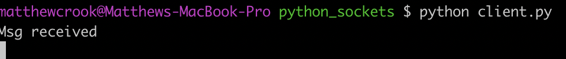
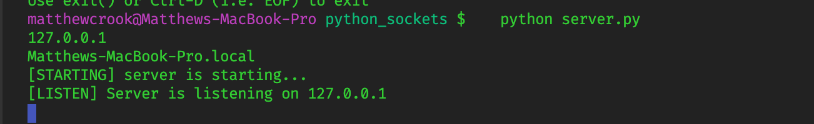
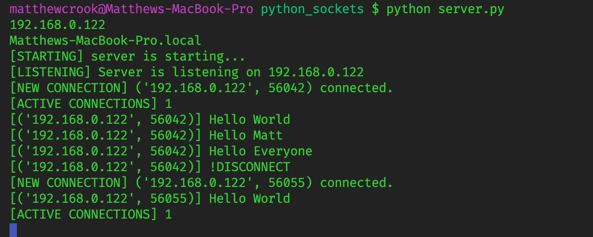

# Python Sockets and Multi-Threading

This is a small example of socket programming that is able to connect multiple clients to a server using python 3 sockets. It can send messages from clients to server, and from server to clients. This example also shows how to host the socket server locally or globally across the internet so anyone can connect. This uses the python 3 socket and threading module.

## Server.py
### Header Script

```py
HEADER = 64
```

First message length sent to server needs to always be of length 64 (bytes). Represents length of message about to come. We read that, get the number, then our program expects to receive the size of the message that is incoming.

### Local IP Address

```py
SERVER = "192.168.0.122"
SERVER = socket.gethostbyname(socket.gethostname())
```

For Mac user, type `ifconfig` in the terminal and will show `inet` (your local IP address).
Another way to get the local IP address automatically is the second script.

### Other Scripts

```py
ADDR = (SERVER, PORT)
FORMAT = 'UTF-8'
DISCONNECT_MESSAGE = "!DISCONNECT"
```

* `ADDR` = Address...bind to socket, put in tuple.
* Every time we send a message we need to encode that (in UTF form).
* When we receive this message, we will disconnect the client from the server and close the connection.

### Indicating Specific Connection

```py
server = socket.socket(socket.AF_INET, socket.SOCK_STREAM)
server.bind(ADDR)
```

* What type of socket or IP address are we going to be looking for specific connections. Matches the `inet` which we took our IP address from running the `ifconfig` command.
* Then pick method which is `SOCK_STREAM`.

### Handle Client

```py
def handle_client(conn, addr):
    (code...)
```

This function will handle the individual connection between the client and the server. In its own thread, concurrently for each client.

```py
 msg_length = conn.recv(HEADER).decode(FORMAT)
```

* Called **blocking** line of code, which means we will not pass this line of code until we receive a message from our client.
* Decoding the encoded format from bytes into a string using UTF-8. (the `FORMAT`)

#### Protocol
* Need a protocol for determining how many bytes we are receiving.
* Also need a check to to make sure `msg` is not `none`. Because when we connect, a message is sent to the server telling us that we connected, but we are trying to immediately handle the message being sent with the length of the message that is about to come...which we haven't sent yet. So, we need to make sure the `msg` is a valid message we can convert into an integer other wise we will run into an issue.
* We do this by writing the below:

```py
if msg_length:
    msg_length = int(msg_length)
    msg = conn.recv(msg_length).decode(FORMAT)
    if msg == DISCONNECT_MESSAGE:
        connected = False
    print(f"[{addr}] {msg}")
conn.send("Msg received".encode(FORMAT))
```


### Start Server Function

```py
def start():
    server.listen()
    print(f"[LISTENING] Server is listening on {SERVER}")
    (code ...)
```
Listening for connections, and then passing those connections to handle client which will run in a new **thread**.

```py
conn, addr = server.accept()
```
Another blocking line of code.

```py
print(f"[ACTIVE CONNECTIONS] {threading.activeCount() - 1}")
```
Print active connections, just so we can see that. Always one connection running, so do - 1 to show connections minus the one running.



## Client.py

```py
client.connect(ADDR)
```
Officially connecting to the server.

### Send Message Function

```py
def send(msg):
    message = msg.encode(FORMAT)
    msg_length = len(message)
    send_length = str(msg_length).encode(FORMAT)
    send_length += b' ' * (HEADER - len(send_length))
    client.send(send_length)
    client.send(message)
    print(client.recv(2048).decode(FORMAT))
```


* Encoding the message from a string into bytes so that we can actually send it through the socket.
* Then follow protocol where length of the first message we send is the length of the message that is about to come.
* (`send_length = str(msg_length).encode(FORMAT)`)Length of first message that we send, representing the length of (`message`) ... which is the message we actually want to send.

* *Pad* (`send_length += b' ' * (HEADER - len(send_length))`) We need to make sure it is 64 bytes long. We don't know it is going to be 64 and doesn't mean it is 64. So take `msg_length`, and subtract from 64 to get the length, so we know how much to Pad it so that it is 64.
* **2048** - just a large number to make sure we will be able to handle whatever message is sent back. Ideally we would use the same protocol we used to send a message to the server, to send back to client. If we don't get this message that means something was wrong on the server side.


## Sending Messages from Client to Client
To send a message from client to client, we would need to store a list globally of messages that are sent from `Client 1` then send that list back to each client. We could make another protocol or thread to send to every single client, or check in a specific client itself which messages it is up to date with. If they don't have the message, you send it to them.


## Sending Something Other Than A String
Sending something that isn't a string, like an object, can send messages that are JSON serialized, or messages that are *'pickled'*. To *pickle*, you `import pickle`, and to pickle a python object is to serialize it and then send that through the socket back to the server and the server can *un-pickle* it and use it.

# Running This Script
By starting the server, (run `server.py`) you should be able to open multiple command line tabs (clients) and run client.py, thus creating new threads. You should also be able to run the client scripts on a different computer (same local IP address) and be able to access the server and open a connection! Just print out a different message and send it through the socket.

<!--  -->

## Globally
To make this work on your public IP address (*the internet*), go to google and search for your public IP address, then in your `SERVER` script, change the address to be your public IP. This however could be more problematic with firewalls, *also security*.
